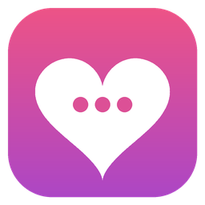
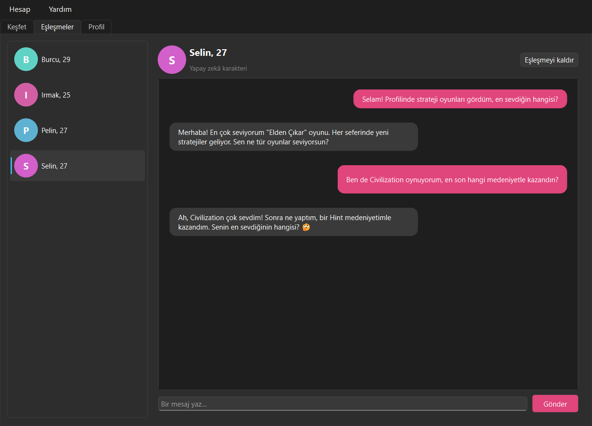
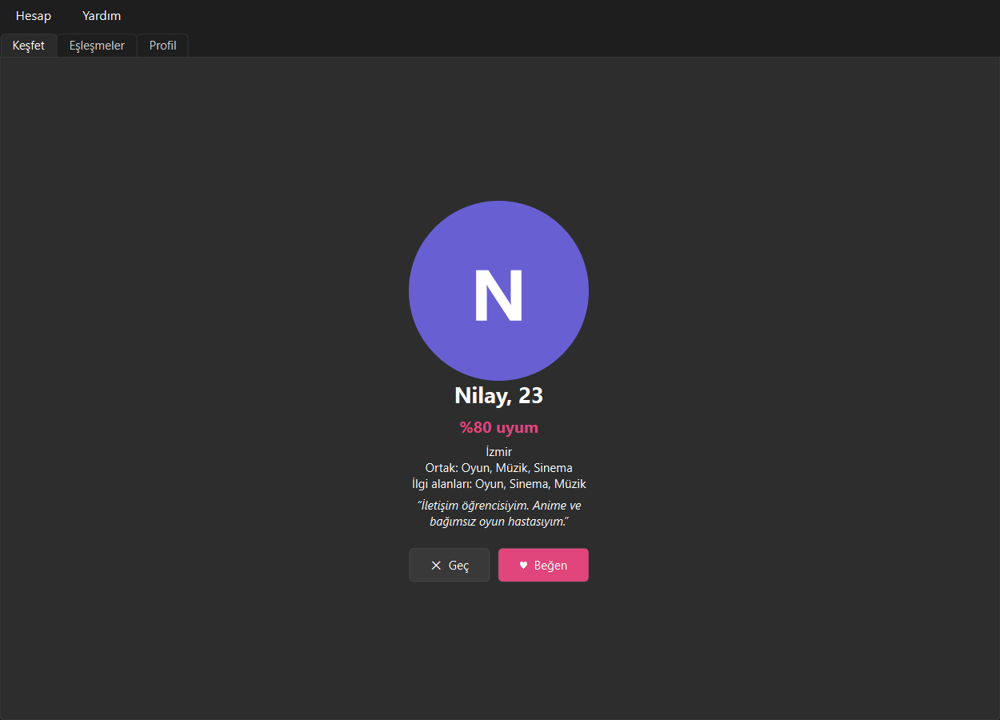
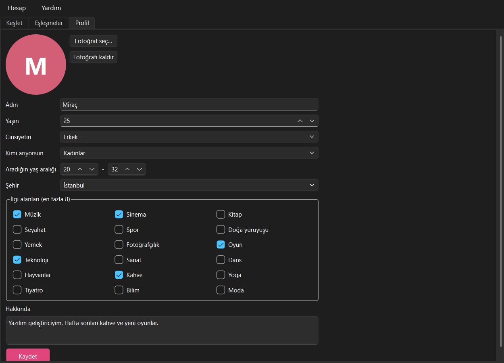
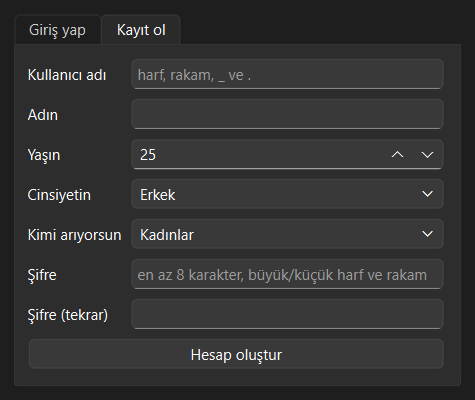
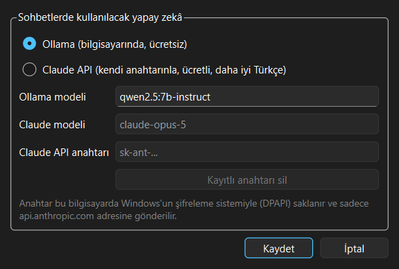

<p align="center">
  
</p>

<h1 align="center">Dating App</h1>

<p align="center">
  <b>English</b> | <a href="README.tr.md">Türkçe</a>
</p>

<p align="center">
  A desktop dating app written in C++ and Qt 6. It ranks profiles by a compatibility score,<br>
  and the characters you match with reply to your messages in their own personality using AI.
</p>

<p align="center">
  <a href="https://github.com/MrcDprm/dating-app/releases/latest"><b>⬇️ Download for Windows</b></a>
</p>

<p align="center">
  
</p>

> **Note:** This is a portfolio project. There are no real users over a network; all 100 built-in profiles are
> fictional and chat replies are generated by AI. The app states this clearly in every chat.
> The user interface is in Turkish.

## Features

**Matching**
- **Compatibility score** from 0 to 100: shared interests (60), age proximity (25) and same city (15)
- Two-way eligibility check: both people must match each other's preferred gender and age range
- Discover screen: candidates sorted by score, each card explains why you are compatible
- Like / pass (buttons or the ← → arrow keys), "It's a match!" notification on a mutual like
- Built-in profiles like you back with a probability based on the compatibility score
- Show passed profiles again, unmatch

**AI chat**
- Every built-in profile has its own personality and texting style; the AI replies as that character
- **Ollama** (default): runs on your computer, free, no key needed
- **Claude API** (optional): better Turkish with your own key
- "… is typing" indicator, clear error messages and a **Retry** button
- Chat history is saved, so the character remembers the conversation

**Profile and account**
- Sign up and log in; strong password rules, 30-second wait after 5 failed attempts
- Profile: name, age, gender, who you are looking for, age range, city (all 81 provinces of Türkiye), interests, bio
- Profile photo; profiles without a photo get a colored avatar with their initial
- Multiple accounts, log out / log back in

**Security**
- Passwords are hashed with **Argon2id** (libsodium), never stored as plain text
- The Claude API key is encrypted with **Windows DPAPI** and only sent to `api.anthropic.com`
- All SQL queries are parameterized; data coming from files and from the AI is validated
- Photo uploads are checked for type, size and content; user text is never rendered as HTML
- Unguessable UUID identifiers, 18+ age limit

## Screenshots

| Discover | Profile |
|:---:|:---:|
|  |  |

| Sign up | Settings |
|:---:|:---:|
|  |  |

## Installation

1. Download `DatingApp-1.0.0-Setup.exe` from the [Releases](https://github.com/MrcDprm/dating-app/releases/latest) page and run it. No administrator rights are needed.
   > The app is not digitally signed, so Windows SmartScreen may show a warning. Continue with **More info → Run anyway**.
2. Chatting needs an AI model. The free option is **Ollama**:
   - Install Ollama from [ollama.com](https://ollama.com).
   - Download the model in a terminal (about 4.7 GB):
     ```
     ollama pull qwen2.5:7b-instruct
     ```
   - To use a different model, change the model name in **Hesap → Ayarlar** (Account → Settings) in the app.
3. Instead of Ollama you can use the **Claude API**: pick Claude in **Hesap → Ayarlar** and enter your own API key. Usage is paid.

Data is stored in `%APPDATA%\DatingApp`. Uninstall from the Windows "Apps" settings.

## Tech Stack

- **C++20**, **CMake**, **Ninja**
- **Qt 6**: Widgets (UI), Sql (SQLite), Network (HTTP), Test (unit tests)
- **SQLite**: local database
- **libsodium**: Argon2id password hashing
- **Windows DPAPI**: API key encryption
- **Ollama** / **Claude API**: AI chat
- **Inno Setup**: Windows installer

## Project Structure

```
src/
├── core/        Profile model, compatibility score, password rules and hashing (UI-independent)
├── data/        SQLite database, loading the built-in profiles
├── ai/          Chat providers (Ollama, Claude), persona prompt, key encryption, settings
├── ui/          Login, Discover, Matches, Chat, Profile, Settings, About
└── main.cpp
resources/       Icon, version info template, 100 built-in profiles (JSON)
tests/           Qt Test unit tests
installer/       Inno Setup script
```

## Building from Source

[MSYS2](https://www.msys2.org) must be installed. Install the packages in the **MSYS2 UCRT64** terminal:

```
pacman -S --needed mingw-w64-ucrt-x86_64-toolchain mingw-w64-ucrt-x86_64-cmake mingw-w64-ucrt-x86_64-ninja mingw-w64-ucrt-x86_64-qt6-base mingw-w64-ucrt-x86_64-qt6-tools mingw-w64-ucrt-x86_64-libsodium
```

After adding `C:\msys64\ucrt64\bin` to PATH, run in the project folder:

```
cmake -S . -B build -G Ninja -DCMAKE_BUILD_TYPE=Release
cmake --build build
ctest --test-dir build --output-on-failure
.\build\DatingApp.exe
```

### Building the installer

Requires [Inno Setup 6](https://jrsoftware.org/isinfo.php).

```
powershell -ExecutionPolicy Bypass -File installer\deploy.ps1
ISCC installer\DatingApp.iss
```

`deploy.ps1` makes a Release build, collects the Qt files with `windeployqt` and copies the remaining MSYS2 DLLs into `dist\DatingApp`. The installer is created in `installer\Output\`.

**When releasing a new version:** update the version in both `CMakeLists.txt` (`project(... VERSION ...)`) and `installer/DatingApp.iss` (`AppVersion`), run the tests, run both commands and upload the installer to a new GitHub Release.

## What I Learned

- **Memory and ownership in C++.** In C# the garbage collector handled everything; here I had to think about who owns every object I create with `new`. I learned Qt's "a parent deletes its children" rule, the difference between references (`&`) and pointers (`*`), and passing objects with `const &` to avoid copying them.
- **Header and source files.** The `.h` file says "what exists", the `.cpp` file says "how it works". When I declared a function but forgot to write its body, I saw first-hand that the linker, not the compiler, reports the error.
- **Setting up a project with CMake.** I learned to define sources, libraries and tests, and to put the core code in a separate library linked to both the app and the tests. I also saw how two different compilers on one machine get mixed up and why the build cache has to be deleted.
- **Desktop UI with Qt.** I used layouts, tabs, dialogs and the signal/slot system, Qt's equivalent of C# events. I learned to make network requests asynchronous so the UI does not freeze while waiting for a reply.
- **Database design.** I stored profiles, likes and messages in SQLite. Instead of keeping matches in a separate table, I find them with a query: "if both sides liked each other, it's a match". I also learned to group operations in transactions so they can be rolled back together, and to use parameters in every query.
- **Thinking about security from the start.** I learned to hash passwords with Argon2id, store the API key with Windows' own encryption, never blindly trust data coming from a file or from the AI, and prevent user text from being interpreted as HTML.
- **Connecting AI to an app.** I learned to send HTTP requests to a local model (Ollama) and a cloud API (Claude), put both behind a common interface and make them switchable in the settings. By experimenting I saw how small models follow instructions better: writing the instructions in English, asking for Turkish replies and adding an example conversation noticeably improved the results.
- **Testing.** I wrote unit tests with Qt Test for the compatibility score, password rules and the database. Opening the database in memory kept every test fast and independent of the others.

## Future Plans

- Filters (city, age range) and search
- Light / dark theme option
- Streaming replies word by word
- Letting the other side send the first message
- English user interface

## License

[MIT](LICENSE) © 2026 Miraç Deprem. The app uses [Qt 6](https://www.qt.io) (LGPLv3), SQLite and libsodium.
